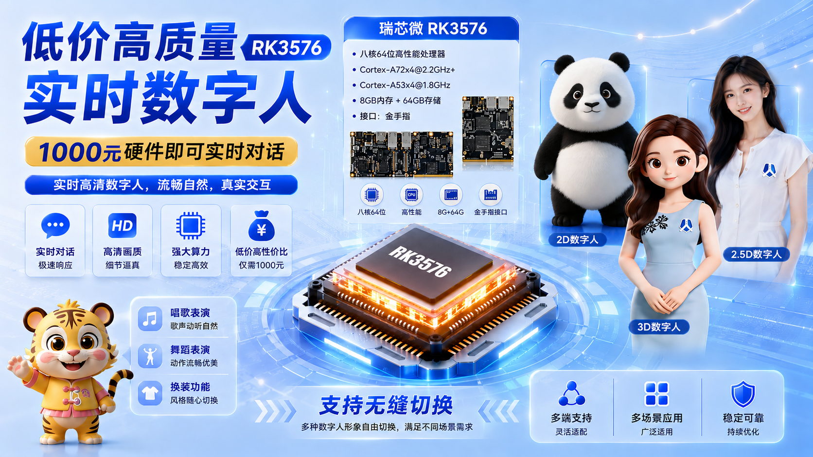

# 🚀 LangYing
### LangYing — Real-Time AI Digital Human System on CPU
### Ultra-low latency real-time AI digital human framework running entirely on CPU. It also supports real-time operation on Rockchip's RK3576.
Supports:
Real-time conversation
Streaming TTS
Lip synchronization
Expression driving
Semantic motion generation
LLM integration
WebRTC / Live streaming

  <b>
    <a href="https://www.bilibili.com/video/BV1ScRrBNEqJ/?spm_id_from=333.1387.homepage.video_card.click&vd_source=7720ff9e037156b51374d14ee8f76b51">Video </a>
    |     
    <a href="https://github.com/langzizhixin">Project Page</a>
    |
    <a href="https://github.com/langzizhixin/LangYing">Code</a> 
  </b>

 

## 📊 Project Poster

  
    
  
## 📊 Application Scenarios

  
    
  
## 📊 Technical Solution

  
    

## 📊 supports  RK3576.

  
    

# 👍  Advantages
## 🖥️ CPU Inference
##### No high-end GPU required, Supports mid-to-high-end mobile CPUs and low-to-mid-end desktop CPUs.
##### Recommended hardware:
##### CPU	Performance
##### Android Snapdragon 8 Gen 2
##### iPhone Apple A18 Pro
##### Intel i3 i5 / Ryzen 5	Basic real-time
##### Intel i7 / Ryzen 7	Smooth real-time
##### Xeon / EPYC	Multi-avatar deployment
##### Budget desktop CPUs	Fully supported
## Supported platforms:
#### Intel
#### AMD
#### ARM

# ⚡ Performance Benchmark
##### CPU Real-Time Test
##### Hardware	Resolution	FPS	Average Delay
##### i3-12100	720P	30 FPS	1s
##### i5-12400	1080P	25-30 FPS	1.2s
##### i7-14700	1080P	30 FPS	700ms
##### Ryzen 7950X	1080P	40 FPS	500ms

## 🎬 Demo

<table class="center">
  <tr style="font-weight: bolder;text-align:center;">
        <td width="50%"><b>  demo   video</b></td>
        <td width="50%"><b>  demo   video</b></td>
  </tr>
  <tr>
    <td>
      <video src=https://github.com/user-attachments/assets/b132fd71-7391-4066-8de4-03045e318537 controls preload></video>
    </td>
    <td>
      <video src=https://github.com/user-attachments/assets/b483c965-f048-43ae-9682-d718062022d0 controls preload></video>
    </td>
  </tr>

</table>

## 📖 Disclaimers
This repositories made by langzizhixin from Langzizhixin Technology company 2026.5.13, in Chengdu, China .
For business cooperation, please contact us by email 277504483@qq.com, or add ours WeChat for communication: langzizhixinkeji 

## 📱 商务合作请加微信联系

  
    
